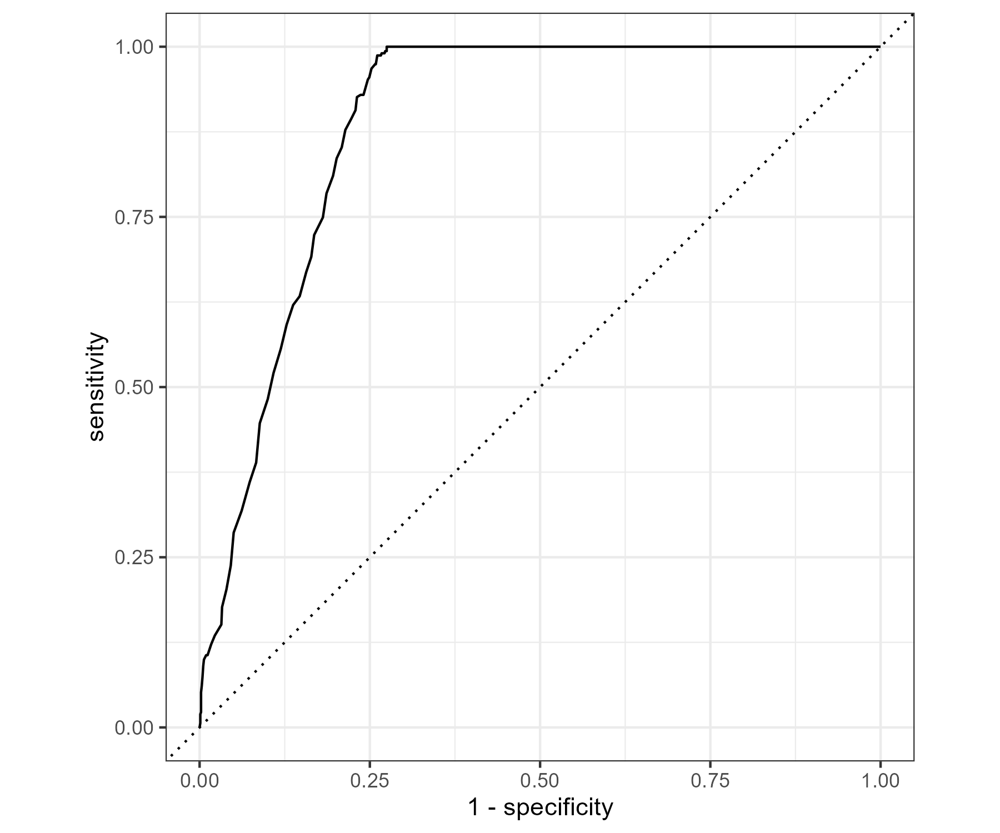
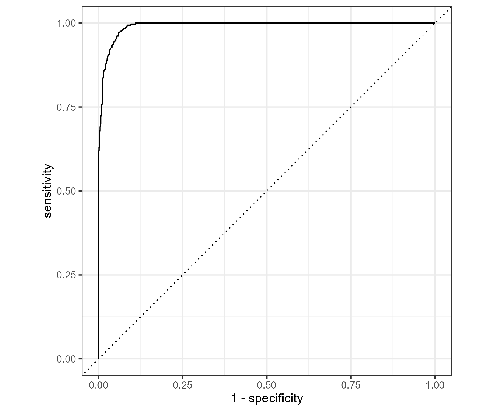

# Supplementary Material

## Additional Figures

Figure S1 shows the ROC curve for Model 1.
```{r}
#| echo: false

```

Figure S2 shows the ROC curve for Model 2.

```{r}
#| echo: false

```

## Additional Tables

Table S1 provides additional model comparison results supporting the findings reported in the main text.

```{r}
#| echo: false
knitr::kable(read.csv("../../../results/tables/model_comparison.csv"))
```